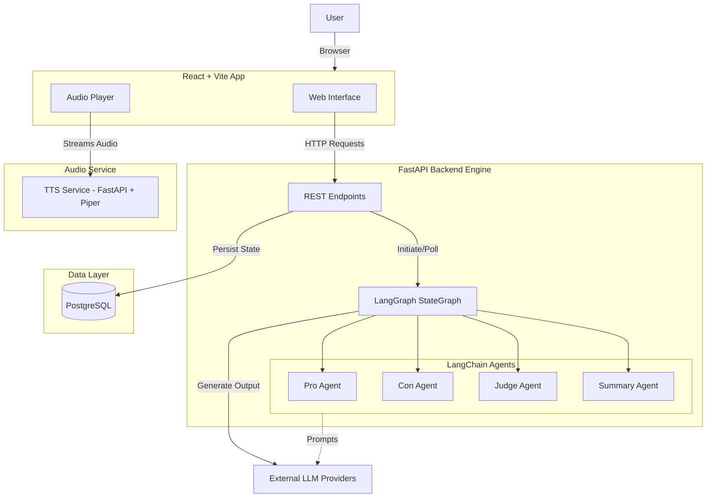
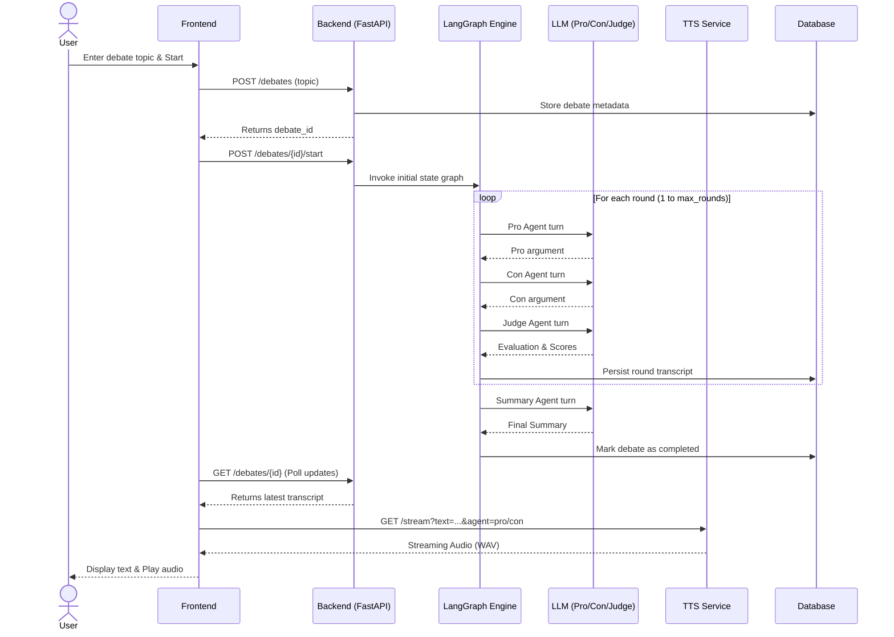

# MindColiseum

MindColiseum is an AI Debate Platform that allows users to witness autonomous AI agents debate on any given topic. Through a structured, multi-round debate format, it explores and evaluates different perspectives using specialized AI agents representing Pro, Con, and Judge roles.

## 🚀 What This Project Does

MindColiseum simulates a comprehensive debate environment where AI models take on distinct personas:
- **Pro Agent**: Formulates arguments in favor of the given topic.
- **Con Agent**: Constructs counter-arguments and viewpoints opposing the topic.
- **Judge Agent**: Evaluates the arguments from both sides and assigns objective scores based on logic and persuasiveness.
- **Summary Agent**: Concludes the debate after the maximum number of rounds has been reached.

Additionally, the platform features a Text-to-Speech (TTS) microservice that brings the debate to life by streaming audio for each agent's argument.

## ⚙️ How It Works

1. **Initialization**: A user provides a debate topic through the Frontend interface.
2. **State Management**: The backend initializes a debate state containing the topic, current round, scores, and transcript.
3. **Debate Loop (LangGraph)**:
   - The StateGraph triggers the **Pro Agent** to generate its argument.
   - The graph transitions to the **Con Agent** for the rebuttal.
   - The **Judge Agent** evaluates both arguments, updates the scores (`pro`, `con`), and increments the round counter.
4. **Conclusion**: When the maximum number of rounds (`max_rounds`) is reached, the graph transitions to the **Summary Agent** to wrap up the debate.
5. **Speech Synthesis**: The Frontend can request the TTS microservice to stream spoken audio for the generated text in real-time.

## 🏗️ High Level Design (HLD)

MindColiseum consists of three main architectural components:

1. **Frontend (React + Vite)**: A responsive web interface where users input topics, view the debate transcript in real-time, and listen to the audio stream.
2. **Backend Engine (FastAPI + LangGraph)**: The core brain of the platform. It exposes REST APIs for managing debates, interacts with a PostgreSQL database to persist debate history, and utilizes LangGraph to orchestrate the LLM agents' workflow.
3. **TTS Microservice (FastAPI + Piper TTS)**: A standalone microservice dedicated to converting the text arguments of the agents into distinct audio voices.

### Architecture Diagram

## 🛠️ Tech Stack Used

- **Frontend**: React 19, Vite, TailwindCSS
- **Backend**: FastAPI, Python, SQLAlchemy, PostgreSQL
- **AI / Orchestration**: LangGraph, LangChain, LLMs
- **Audio Service**: Piper TTS, FastAPI
- **Infrastructure**: Docker & Docker Compose (for PostgreSQL)

## 📊 Sequence Diagram

